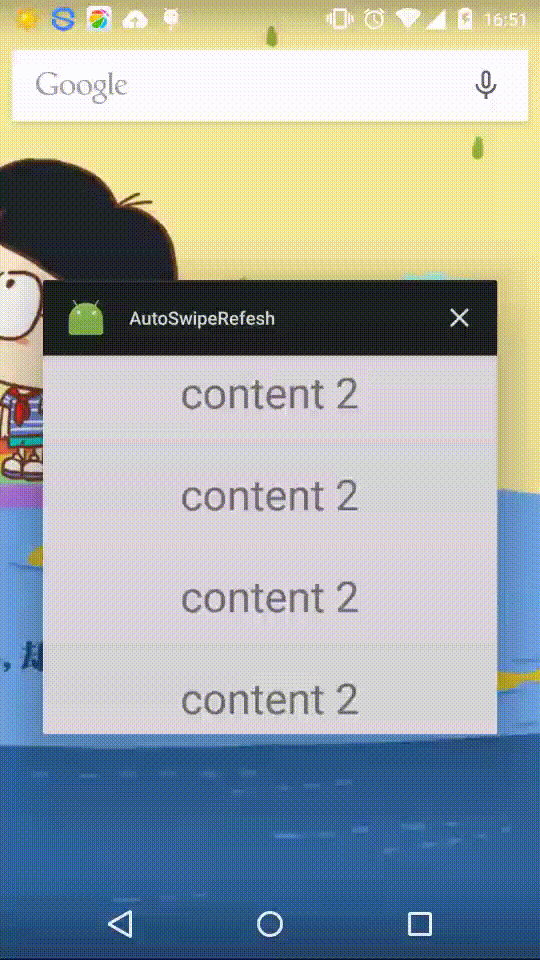

# AutoSwipeRefresh
> **AutoSwipeRefresh** Just a demo for us how to implement auto refresh when first reach a page using [SwipeRefreshLayout](https://developer.android.com/reference/android/support/v4/widget/SwipeRefreshLayout.html),
but need to change some source code.And also a wonderful foot view from [WaitingDots](https://github.com/tajchert/WaitingDots),absolutely,i modify it...




# What changed

[SwipeRefreshLayout.java](https://github.com/futuresimple/android-support-v4/blob/master/src/java/android/support/v4/widget/SwipeRefreshLayout.java) in this file.

```java
    public void setRefreshing(boolean refreshing) {
        if (refreshing && mRefreshing != refreshing) {
            // scale and show
            mRefreshing = refreshing;
            int endTarget = 0;
            if (!mUsingCustomStart) {
                endTarget = (int) (mSpinnerFinalOffset + mOriginalOffsetTop);
            } else {
                endTarget = (int) mSpinnerFinalOffset;
            }
            setTargetOffsetTopAndBottom(endTarget - mCurrentTargetOffsetTop,
                    true /* requires update */);
                    /**
                     when i call setRefreshing(true) outside,params mNotify can never be true,only when u swipe down by gesture see callBack method onTouchEvent -- MotionEvent.ACTION_CANCEL
                     and variable mRefreshListener -- onAnimationEnd
                     NOTE: version of v4 must >= 21
                    */
            mNotify = true;
            startScaleUpAnimation(mRefreshListener);
        } else {
            setRefreshing(refreshing, false /* notify */);
        }
    }

```

##DEMO USED
* ``` base-adapter-helper ```  [link](https://github.com/JoanZapata/base-adapter-helper)

# License

```
Copyright 2013 Bruce too

Licensed under the Apache License, Version 2.0 (the "License");
you may not use this file except in compliance with the License.
You may obtain a copy of the License at

    http://www.apache.org/licenses/LICENSE-2.0

Unless required by applicable law or agreed to in writing, software
distributed under the License is distributed on an "AS IS" BASIS,
WITHOUT WARRANTIES OR CONDITIONS OF ANY KIND, either express or implied.
See the License for the specific language governing permissions and
limitations under the License.

This project uses Picasso from Square, which is licensed under the same
license as this project. You can find the project page at

    http://square.github.io/picasso/
    
The sample application uses Twitter4j by Yusuke Yamamoto, 
ActionBarSherlock by Jake Wharton, and AndroidAnnotations by Pierre-Yves Ricau, 
all of them being licensed under the Apache license version 2.0.
```
